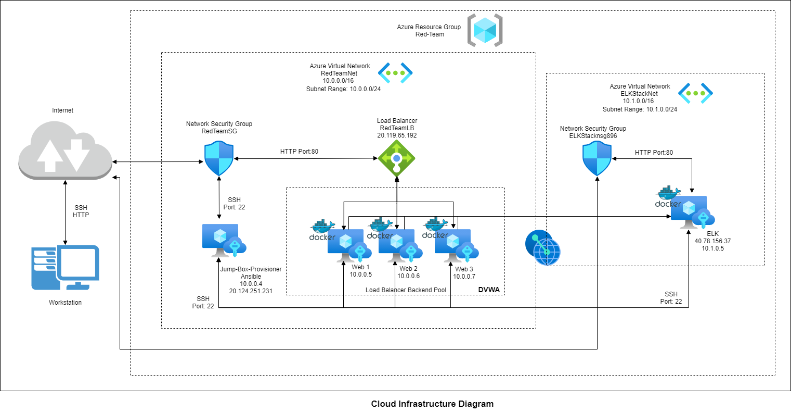

# Red-Team-Cloud-Network
### Description of the Topology
The files in this repository were used to configure the network depicted below.

These files have been tested and used to generate a live ELK deployment on Azure. They can be used to either recreate the entire deployment pictured above. Alternatively, select portions of the YAML file may be used to install only certain pieces of it, such as Filebeat.
  -  [filebeat-playbook.yml](Ansible/filebeat-playbook.yml) 
  -  [filebeat-config.yml](Ansible/filebeat-config.yml) 
  -  [metricbeat-playbook.yml](Ansible/metricbeat-playbook.yml) 
  -  [metricbeat-config.yml](Ansible/metricbeat-config.yml) 
  -  [install-elk.yml](Ansible/install-elk.yml) 
  -  [hosts.yml](Ansible/hosts.yml) 
  -  [ansible.cfg](Ansible/ansible.cfg) 

This document contains the following details:
- Description of the Topology
- Access Policies
- ELK Configuration
  - Beats in Use
  - Machines Being Monitored
- How to Use the Ansible Build

The main purpose of this network is to expose a load-balanced and monitored instance of DVWA, the Damn Vulnerable Web Application.

Load balancing ensures that the application will be highly __available__, in addition to restricting __traffic__ to the network.
- Load balancers protect a network from DDoS attacks.  The advantage of having a jump box is that only one machine on your network will be connected to the internet, as well as allowing automation over machines on your network. 

Integrating an ELK server allows users to easily monitor the vulnerable VMs for changes to the **logs** and system __metrics__.
- Filebeat watches for changes in a machines logs.
- Metricbeat collects statistics from services on a machine as well as the operating system.

The configuration details of each machine may be found below.

| Name     | Function  | IP Address    | Operating System |
| -------- | --------- | ------------- | ---------------- |
| Jump Box | Gateway   | 20.124.251.18 | Linux            |
| Web-1    | DVWA      | 10.0.0.5      | Linux            |
| Web-2    | DVWA      | 10.0.0.6      | Linux            |
| Web-3    | DVWA      | 10.0.0.7      | Linux            |
| Elk      | ELK stack | 10.2.0.4      | Linux            |

### Access Policies

The machines on the internal network are not exposed to the public Internet. 

Only the __Jump Box__ machine can accept connections from the Internet. Access to this machine is only allowed from the following IP addresses:
# local public IP address

Machines within the network can only be accessed by __the jumpbox__.

- The jumpbox's public IP address is 20.124.251.18

A summary of the access policies in place can be found in the table below.

| Name     | Publicly Accessible | Allowed IP Addresses                     |
| -------- | ------------------- | ---------------------------------------- |
| Jump Box | Yes (SSH)           | local machine IP address                 |
| Web-1    | Yes (HTTP)          | local machine IP address : 20.124.251.18 |
| Web-2    | Yes (HTTP)          | local machine IP address : 20.124.251.18 |
| Web-3    | Yes (HTTP)          | local machine IP address : 20.124.251.18 |
| ELK      | Yes (HTTP)          | local machine IP address : 20.124.251.18 |

### Elk Configuration

Ansible was used to automate configuration of the ELK machine. No configuration was performed manually, which is advantageous because it provides consistent deployment as well as the ability to configure multiple machines at once. 

The playbook implements the following tasks:
- Install docker.io
- install python3-pip
- install the docker module
- increase virtual memory
- allocate that increased memory
- download docker elk image and launch that image
- enable docker service on boot

The following screenshot displays the result of running `docker ps` after successfully configuring the ELK instance.

![2021-12-02 20_33_45-sysadmin@ELK_ ~]!(images/2021-12-02%2020_33_45-sysadmin%40ELK_%20~.png)

### Target Machines & Beats
This ELK server is configured to monitor the following machines:
- Web-1 10.0.0.5
- Web-2 10.0.0.6
- Web-3 10.0.0.7

We have installed the following Beats on these machines:
- These machines have filebeat and metricbeat installed.

These Beats allow us to collect the following information from each machine:
- Metricbeat allows us to collect machine metrics and statistics like the CPU usage of the machine. 
- Filebeat allows us to collect and monitor logs from the machine like ones generated by mysql databases or from files generated by apache.

### Using the Playbook
In order to use the playbook, you will need to have an Ansible control node already configured. Assuming you have such a control node provisioned: 

SSH into the control node and follow the steps below:
- Copy the __Playbook__ file to __/etc/ansible__.
- Update the __hosts__ file to include the IP addresses of machines you want to configure, as well as python interpreter it'll be using. 
- Run the playbook, and navigate to the newly configured virtual machine to check that the installation worked as expected.

- The playbook files are the .yml files that begin with a line reading " --- " . These files need to be copied to the folder /etc/ansible.
- The hosts file is used to tell Ansible which machines to configure. Inside the hosts file you can designate  different groups by writing a group name in brackets, such as [webservers]
- http://<public_ELK_IP>:5601/app/kibana
